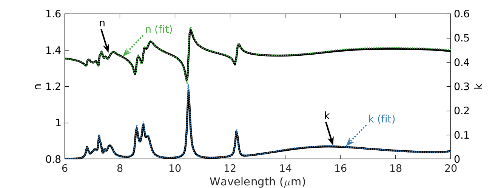

# optichem - optical properties from ATR data

<!--ts-->
   * [Installation](#installation)
   * [Usage & Tests](#usage)
   * [Documentation](#Documentation)
   * [Validation](#Validation)
<!--te-->

A python packge that extracts the optical properties of solid and liquid chemicals by fitting Attenuated Total Reflectance (ATR) measurements. Below is an example fit of the absorption spectra of isopropyl alcohol (IPA). 

## Installation
Run the follow commands:

## Usage

## Documentation
A description of our tool is outlined in paper.md. 

## Validation

