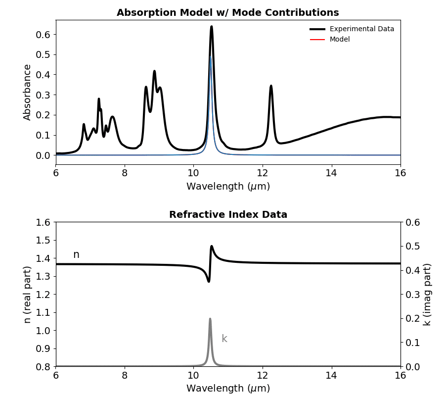

# optichem - optical properties from ATR data

<!--ts-->
   * [1. Installation](#1-installation)
   * [2. Usage and Tutorials](#2-usage-and-tutorials)
   * [3. Documentation](#3-documentation)
   * [4. Tool Validation](#4-tool-validation)
<!--te-->

**optichem** is a python packge used to extract the optical properties of solid and liquid chemicals by fitting Attenuated Total Reflectance (ATR) measurements. Below is an example fit of the absorption spectra and extracted optical properties of isopropyl alcohol (IPA). 
<p align="center">
  
</p>


## 1. Installation
#### 1.1 Installing Optichem
Download/clone **optichem**, navigate to the root directory, and install:
```
git clone https://github.com/sean-mcsherry/optichem.git
cd optichem
python3 setup.py install
```

#### 1.2 Installing Jupyter & enabaling the ipympl backend
It is reccommended to use an Jupyterlab, an interactive IPython notebook. To install, run:
```
pip3 install jupyterlab
```
To enable to the ipympl backend and use the interactive matplotlib widgets, make sure to start each .ipynb with the following code:

```
%matplotlib widget
```

## 2. Usage and Tutorials
Please navigate to the following tutorials:
#### 2.1 Use the semi-automatic fitting procedure in **optichem** in Jupyter of from the terminal 
[**optichem** with Jupyter](tutorials/optichem_with_jupyter.ipynb)<br/>
Although not necessary, it is reccomended to run **optichem** with JupyterLab or Jupyter notebook. Here, you can enable the ipympl backend to take advantage of the interactive matplotlib widgets, which makes selecting a wavelength range and adding/removing vibrational modes (~absorption peaks) to plots very simple.

[**optichem** from the terminal](tutorials/optichem_from_terminal.ipynb)<br/>
Alternatively, you can run **optichem** from the terminal and still take advtange of matplotlib widgets.

#### 2.2 Use the manual fitting procedure in **optichem** 
[**optichem** with manual peak find](tutorials/optichem_manual_fit.ipynb)<br/>
In both previous tutorials, the **optichem** module *semi_auto_fit* is employed, which provides suggested vibrational modes based on the absorbance peaks in the upload ATR data. New and existing vibrational modes can be added, removed, or changed with ease by using the matplotlib widgets. However, there are scenarios in which the user wants to manually set vibrational modes in the script. This tutorial provides an example of how to manually set the vibrational modes. 

#### 2.3 *Stitch* together many wavelength ranges
[**optichem** tutorial on stitching](tutorials/optichem_stitch.ipynb)<br/>
If there are several modes in your wavelength range (>10-15) it is reccomended to split the wavelength up into a few ranges. Once you fit modes to each absoprtion spectra, you can stitch together the whole spectra. This provides a more accurate fit, however, can take several minutes to compute. Be patient.

#### 2.4 Loading a fit
[**optichem** load fit](tutorials/optichem_load.ipynb)<br/>
Here, follow the tutorial to learn how to load your fit based on saved data.


## 3. Documentation
A detailed description of our tool is outlined in paper.md. Further documentation can be found on the **optichem** Wiki. 

## 4. Tool Validation
We collected ATR measurements for isopropyl alcohol (IPA) and polydimethylsiloxane (PDMS) with a single bounce, diamond crystal ATR with an incidence angle of 45 degrees. By using **optichem** we fit the absorbance spectrum and extracted the optical properties (seen below). Our fit was compared to the optical properteis of IPA and PDMS reported by others on refractiveindex.info. Qualitatively, our fit matches well to previously reported values. 

<p align="center">

  
  

</p>


