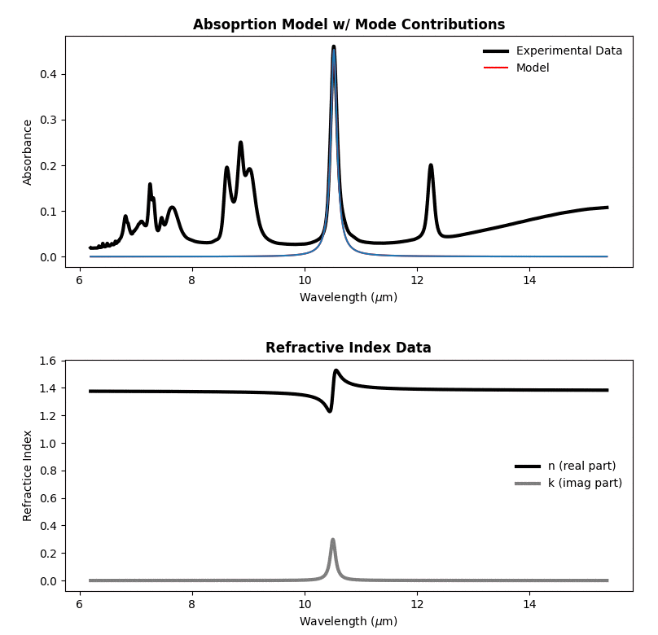
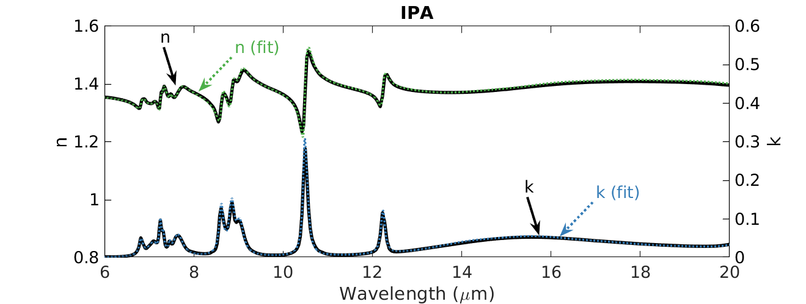
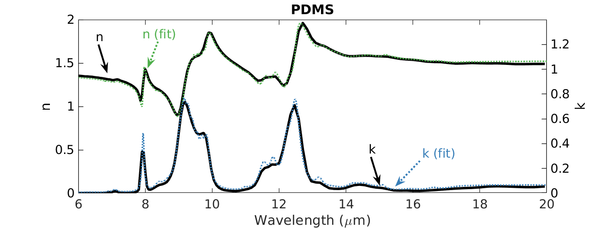

# optichem - optical properties from ATR data

<!--ts-->
   * [Installation](#installation)
   * [Usage & Tests](#usage)
   * [Documentation](#Documentation)
   * [Validation](#Validation)
<!--te-->

**optichem** is a python packge used to extract the optical properties of solid and liquid chemicals by fitting Attenuated Total Reflectance (ATR) measurements. Below is an example fit of the absorption spectra and extracted optical properties of isopropyl alcohol (IPA). 

  

## Installation
Run the follow commands:

## Usage
[**optichem** with Jupyter](tutorials/optichem_with_jupyter.md) 
Although not necessary, it is reccomended to run **optichem** with JupyterLab or Jupyter notebook. Here, you can enable the ipympl backend to take advantage of the interactive matplotlib widgets, which makes selecting a wavelength range and adding/removing vibrational modes (~absorption peaks) to plots very simple.

[**optichem** from the terminal](tutorials/optichem_from_terminal.md) 
Alternatively, you can run **optichem** from the terminal and still take advtange of matplotlib widgets.

[**optichem** with manual peak find](optichem_manual_fit.md) 
In both previous tutorials, the **optichem** module *semiauto_fit* is employed, which provides suggested vibrational modes based on the absorbance peaks in the upload ATR data. New and existing vibrational modes can be added, removed, or changed with ease by using the matplotlib widgets. However, there are scenarios in which the user wants to manually set vibrational modes in the script. This tutoriaul provides and example of how to manually set the vibrational modes. 

## Documentation
A detailed description of our tool is outlined in paper.md. Further documentation can be found on the **optichem** Wiki. 

## Validation
We collected ATR measurements for isopropyl alcohol (IPA) and polydimethylsiloxane (PDMS) with a single bounce, diamond crystal ATR with an incidence angle of 45 degrees. By using **optichem** we fit the absorbance spectrum and extracted the optical properties (seen below). Our fit was compared to the optical properteis of IPA and PDMS reported by others on refractiveindex.info. Qualitatively, our fit matches well to previously reported values. 

  
  

