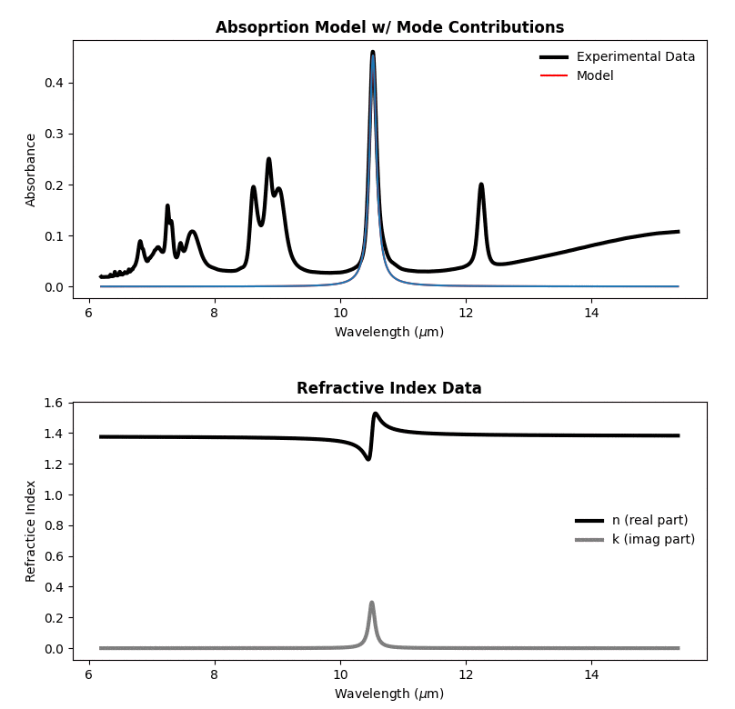
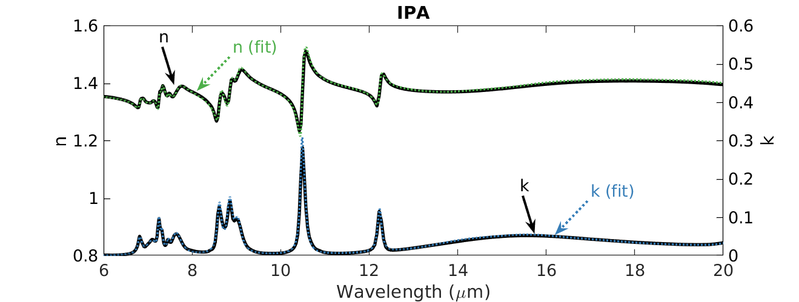
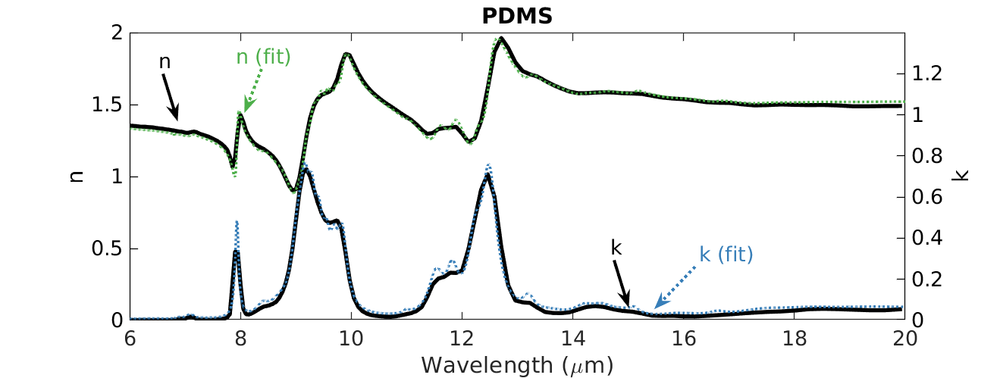

# optichem - optical properties from ATR data

<!--ts-->
   * [Installation](#installation)
   * [Usage & Tests](#usage)
   * [Documentation](#Documentation)
   * [Validation](#Validation)
<!--te-->

*optichem* is a python packge used to extract the optical properties of solid and liquid chemicals by fitting Attenuated Total Reflectance (ATR) measurements. Below is an example fit of the absorption spectra and extracted optical properties of isopropyl alcohol (IPA). 

## Installation
Run the follow commands:

## Usage

## Documentation
A description of our tool is outlined in paper.md. 

## Validation
We collected ATR measurements for isopropyl alcohol (IPA) and polydimethylsiloxane (PDMS) with a single bounce, diamond crystal ATR with an incidence angle of 45 degrees. By using *optichem* we fit the absorbance spectrum and extracted the optical properties (seen below). Our fit was compared to the optical properteis of IPA and PDMS reported by others on refractiveindex.info. Qualitatively, our fit matches well to previously reported values. 

